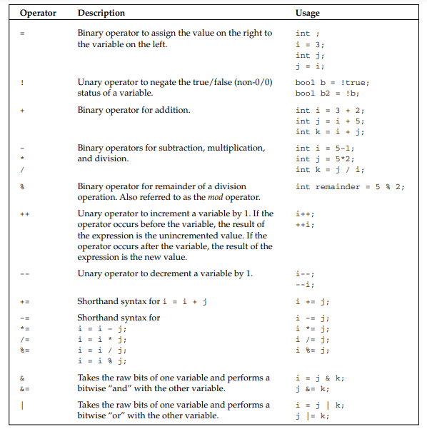
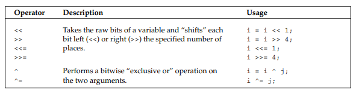

What good is a variable if you don’t have a way to change it? The table below shows the most common operators used in C++ and sample code that makes use of them. Note that operators in C++ can be binary (operate on two variables), unary (operate on a single variable), or even ternary (operate on three variables). There is only one ternary operator in C++ and it is covered in the next section, "Conditionals."

  

  
